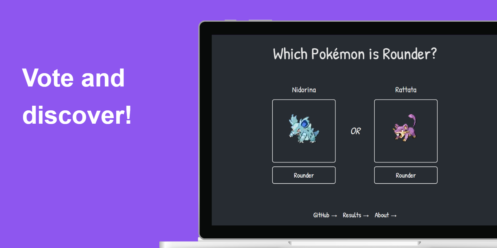
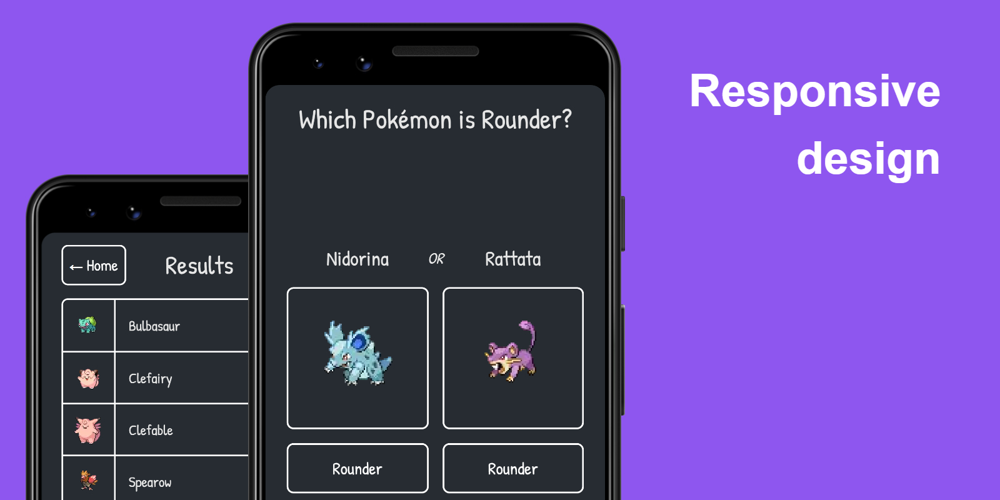
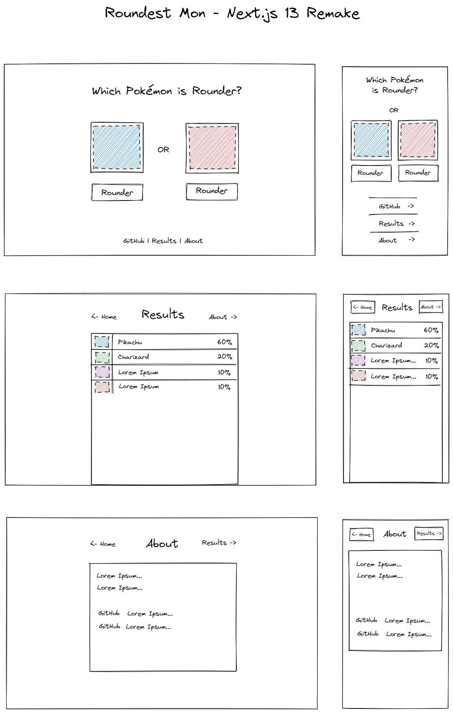

# 👾 Roundest Mon



Roundest Mon is a web-based application that allows users to vote on which Pokemon they think is the roundest. The Pokemons are pulled from a database and new pair will be presented after each vote.

> **Note**
> This project is still under development and has not been deployed yet. I'm still figuring out some stuff and learning many things.

## Table of Contents

<details>
  <summary>Introduction</summary>

- [Getting Started](#getting-started)
- [Motivation](#motivation)
- [Design and layout](#design-and-layout)
</details>

<details>
  <summary>Installation</summary>

- [Project Setup](#project-setup)
- [Environment Variables](#environment-variables)
- [Seed your Database](#seed-your-database)
- [Running Locally](#running-locally)
- [API Reference](#api-reference)
- [Technical Details](#technical-details)
</details>

<details>
  <summary>About the Project</summary>

- [Contributing](#contributing)
- [Disclaimer](#disclaimer)
- [License](#license)
</details>

## Getting Started

- Visit the [website]() (_Not deployed yet_) on your preferred web browser
- On the main page, you will see two randomly selected Pokemon and their images
- Cast your vote by clicking on the "Vote" button below to the Pokemon
- You can view the voting results by clicking on the "Results" link at the bottom of the page

## Motivation

This app was originally created by Theo @t3dotgg on his YouTube channel.
I followed along with his video and built a very similar app, however I wanted to try making it on my own to see if I could do it as well.
So this is the result.

## Design and layout



<details>
  <summary>Show the Excalidraw design mockup</summary>



</details>

## Installation

### Project setup

```bash
git clone https://github.com/mateusabelli/roundest-next-13.git

cd roundest-next-13

npm install
```

### Environment Variables

```bash
mv .env.example .env

# Modify the DB URL in your .env
DATABASE_URL="sqlserver://localhost:1433;database=roundest;integratedSecurity=true;trustServerCertificate=true;"

# Check out https://www.prisma.io/docs/reference/database-reference/connection-urls
# For examples with different DB connection strings.
```

### Seed your database

```bash
npm run ts-node ./lib/seed.ts

# Make sure to delete the tables if you need to run this more than once
```

### Running locally

```bash
# Start the dev server on localhost:3000
npm run dev

# Same as above but with TurboPack
npm run turbo
```

### API Reference

The app uses the [PokeAPI](https://github.com/PokeAPI) repository to retrieve the sprites of the Pokemons.

## Technical Details

- Built using Next.js 13
- Styled using CSS Modules
- Utilizes the PokeAPI for sprites
- The app is mobile-friendly and responsive to different screen sizes
- Utilizes Prisma ORM for flexibility to use different DBs
- Made with App directory and beta features of Next.js 13

## Contributing

If you would like to contribute to the development of this app, please feel free to fork the repository and make a pull request with your changes.

## Disclaimer

Pokemon is a trademark of Nintendo. This web app is not endorsed or affiliated with Nintendo in any way.

## License

This project is licensed under the **MIT License**. See the LICENSE file for details.
